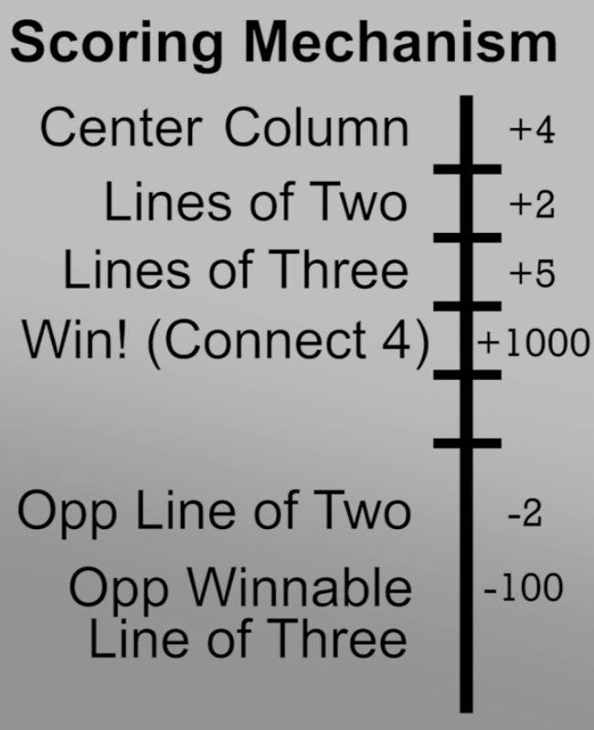

# Connect4-AI

This is a Connect 4 AI built with numpy, pygame, sys, math, and the random module.

## AI:


This game's AI is using the minimax algorithm. Minimax is a backtracking algorithm commonly used in board game AI's. There are two components to minimax: the maximiser and the minimiser. The maximiser tries to get the highest score possible while the minimiser tries to get the lowest score possible (how score is chosen is above). If the maximiser has upper hand then, the score of the board will tend to be some positive value. If the minimiser has the upper hand in that board state then it will tend to be some negative value.

**Example in my code**:
```
def minimax(board, depth, alpha, beta, maximizingPlayer):
	"""
	Minimax function for AI.
	"""
	valid_locations = get_valid_locations(board)
	is_terminal = is_terminal_node(board)
	if depth == 0 or is_terminal:
		if is_terminal:
			if winning_move(board, AI_PIECE):
				return (None, 100000000000000)
			elif winning_move(board, PLAYER_PIECE):
				return (None, -10000000000000)
			else: # Game is over, no more valid moves
				return (None, 0)
		else: # Depth is zero
			return (None, score_position(board, AI_PIECE))
	if maximizingPlayer:
		value = -math.inf
		column = random.choice(valid_locations)
		for col in valid_locations:
			row = get_next_open_row(board, col)
			b_copy = board.copy()
			drop_piece(b_copy, row, col, AI_PIECE)
			new_score = minimax(b_copy, depth-1, alpha, beta, False)[1]
			if new_score > value:
				value = new_score
				column = col
			alpha = max(alpha, value)
			if alpha >= beta:
				break
		return column, value

	else: # Minimizing player
		value = math.inf
		column = random.choice(valid_locations)
		for col in valid_locations:
			row = get_next_open_row(board, col)
			b_copy = board.copy()
			drop_piece(b_copy, row, col, PLAYER_PIECE)
			new_score = minimax(b_copy, depth-1, alpha, beta, True)[1]
			if new_score < value:
				value = new_score
				column = col
			beta = min(beta, value)
			if alpha >= beta:
				break
		return column, value
```

As you can see in my minimax algorithm code, I have a minimiser and a maximiser. I return the column, value of either the minimiser or the maximiser decision. Which one has the upper hand dictates where I return those values.

**Citations**:
https://www.geeksforgeeks.org/minimax-algorithm-in-game-theory-set-1-introduction/
https://www.youtube.com/watch?v=y7AKtWGOPAE

#### Running the Game:
```
git clone https://github.com/henryboisdequin/Connect4-AI.git
cd Connect4-AI
pip3 install numpy pygame
python3 connect4.py
```
